<div align="center">


<h1>Azure Virtual Desktop (AVD) Automation Runbook Platform</h1>

<p><strong>Cloud-Native Intelligent Operations & Governance for Enterprise End-User Computing</strong></p>

[](/apps/runbook-engine)
[](https://devopstrio.co.uk/)
[](/security)
[](/apps/autoscale-engine)

</div>

---

## 🏛️ Executive Summary

The **AVD Automation Runbook Platform** is a flagship enterprise solution architected to eliminate manual overhead in the management of massive Azure Virtual Desktop estates. By codifying Day-2 operations into intelligent, event-driven runbooks, organizations can achieve true hyperscale with minimal administrative friction.

The platform bridges the gap between raw infrastructure and product operations, providing a centralized control plane for **automated scaling**, **self-healing incident remediation**, **golden image lifecycle management**, and **governance-as-code**.

### Strategic Business Outcomes
- **Operational Excellence**: Automate 80% of routine VDI management tasks, from session host patching to user onboarding.
- **Hyperscale Cost Efficiency**: Save millions in cloud compute through AI-driven host pool scaling that aggressively deallocates idle resources during off-peak windows.
- **Hardened Compliance**: Maintain a perpetual state of "clean" through automated drift detection and remediation of security baselines.
- **Incident Resilience**: Reduce MTTR by 60% using self-healing workflows that detect and resolve "Stuck Sessions" and "FSLogix mount failures" before users report them.

---

## 🏗️ Technical Architecture Details

### 1. High-Level Automation Architecture
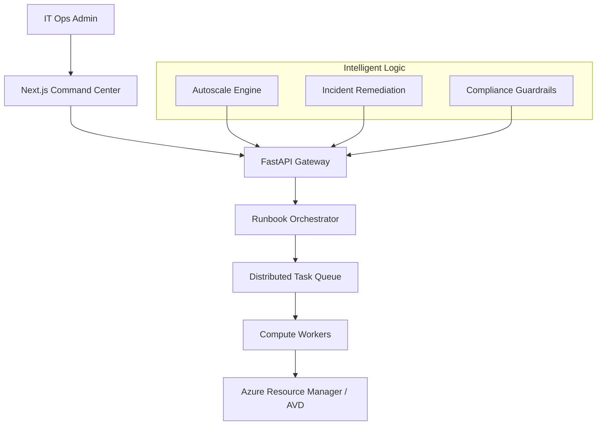

### 2. Runbook Execution Lifecycle
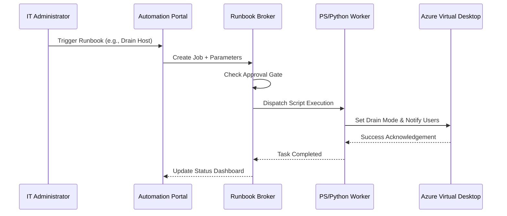

### 3. Host Pool Autoscale Lifecycle
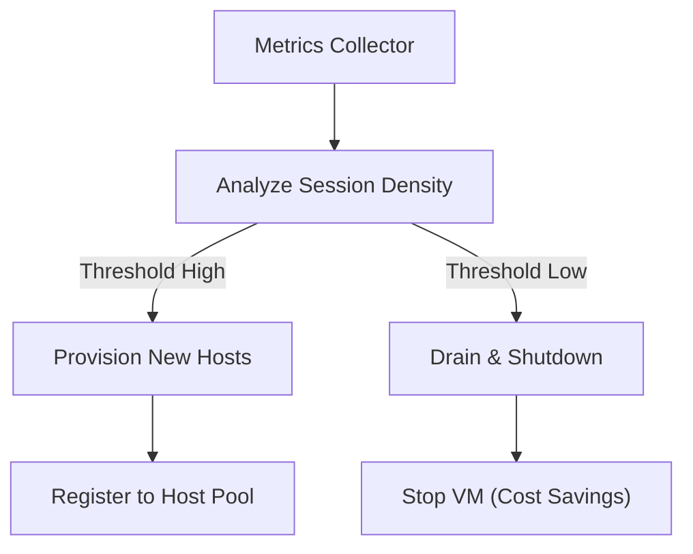

### 4. Image Patch Pipeline
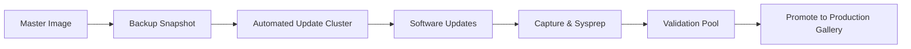

### 5. Incident Remediation Flow (Self-Healing)
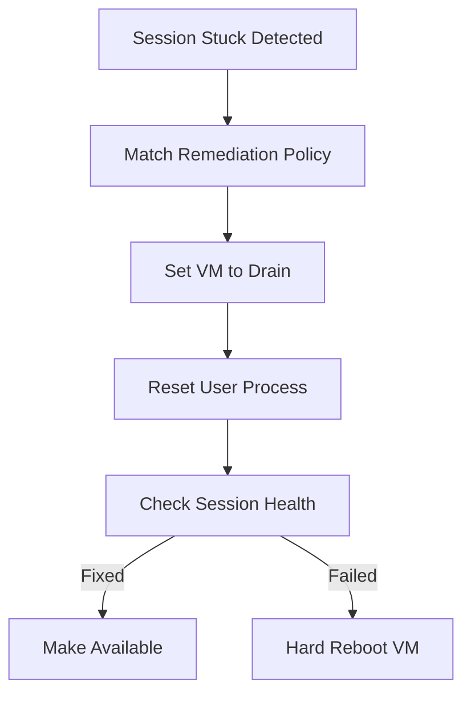

### 6. Security Trust Boundary
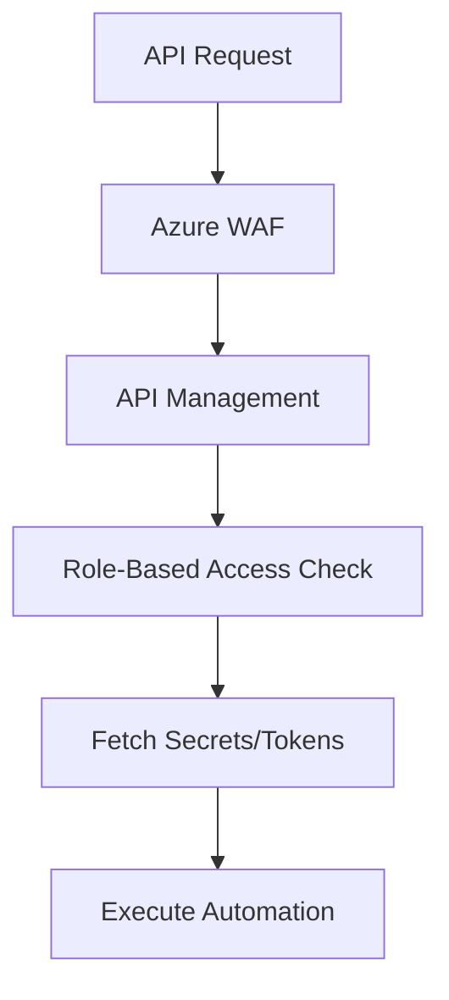

### 7. Global Region Topology
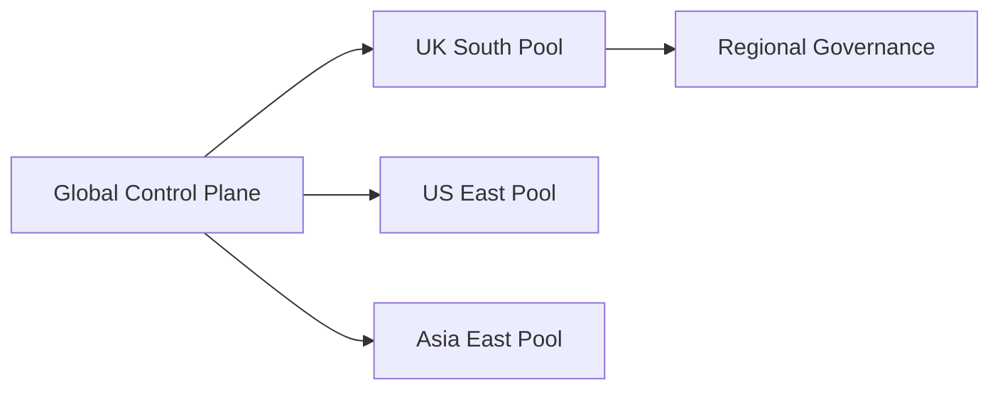

### 8. API Request Lifecycle
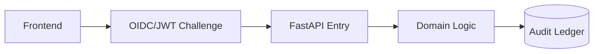

### 9. Multi-Tenant Model
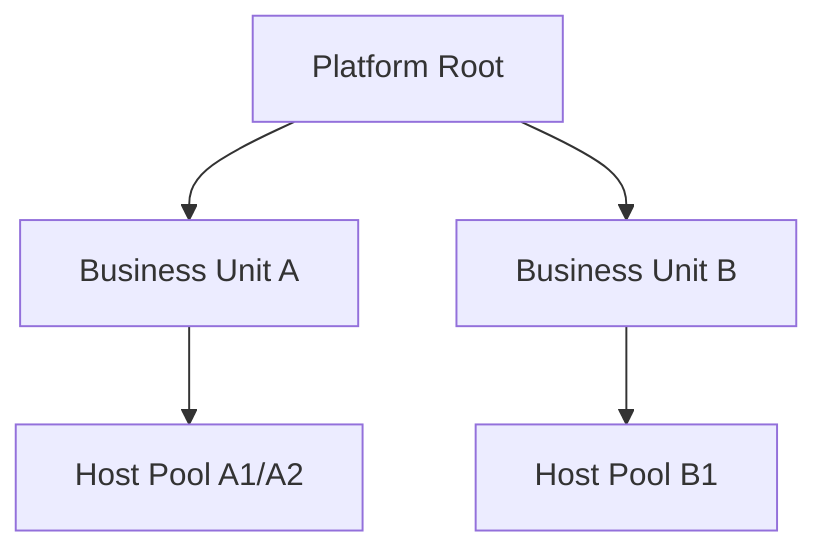

### 10. Monitoring & Telemetry Flow
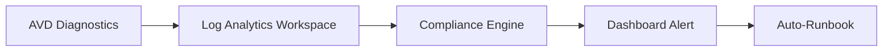

### 11. Disaster Recovery Topology
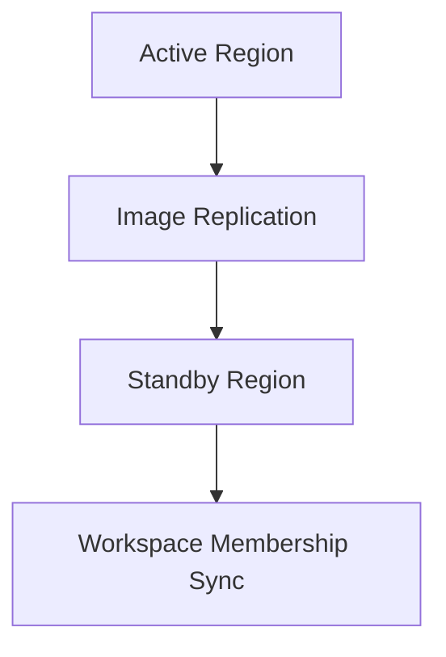

### 12. User Onboarding Flow
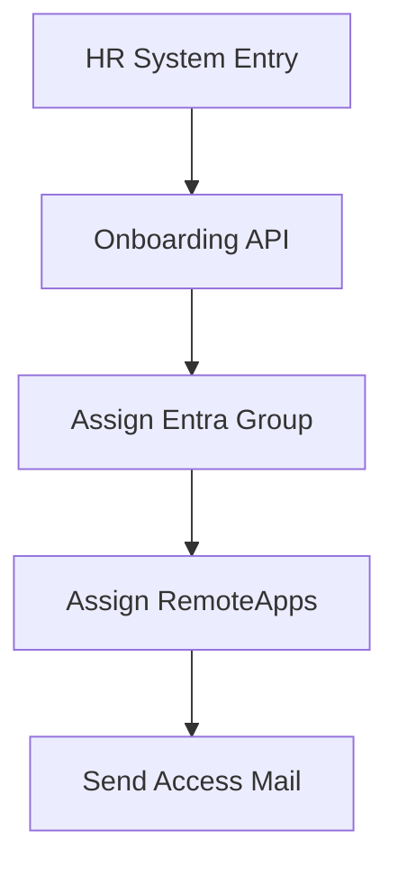

### 13. Cost Shutdown Workflow
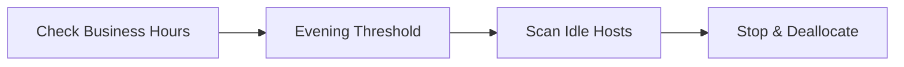

### 14. CI/CD Operations Pipeline
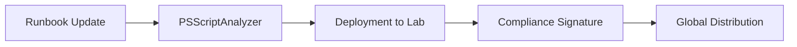

### 15. Executive Governance Workflow
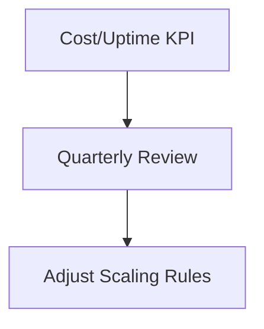

### 16. Session Host Lifecycle
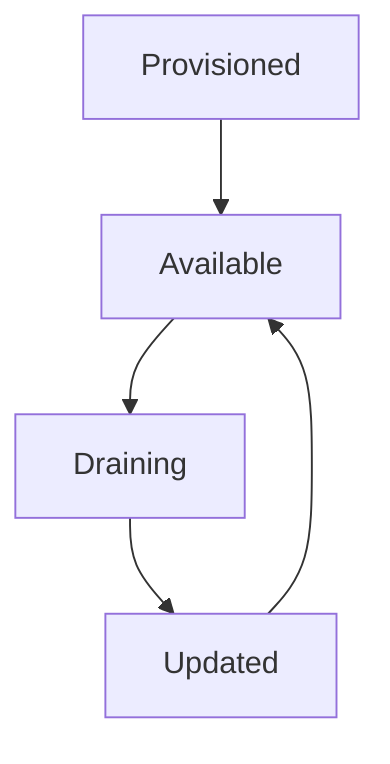

### 17. Identity Federation Model
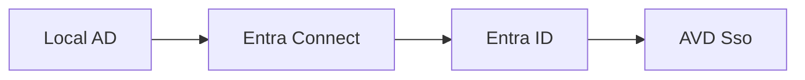

### 18. Approval Workflow
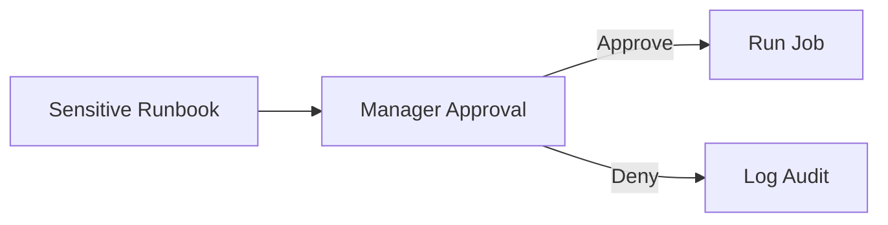

### 19. Disaster Recovery Failover Pipeline
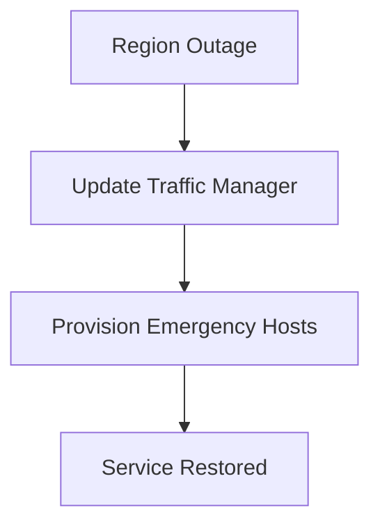

### 20. Compliance Drift Workflow
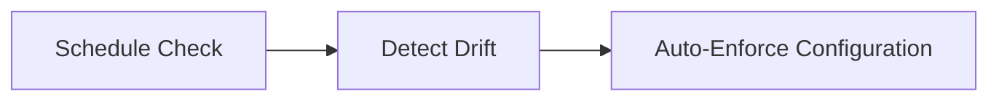

---

## 🚀 Environment Deployment

### Terraform Orchestration
```bash
cd terraform/environments/prd
terraform init
terraform apply -auto-approve
```

---
<sub>&copy; 2026 Devopstrio &mdash; Engineering the Autonomous Workspace.</sub>
